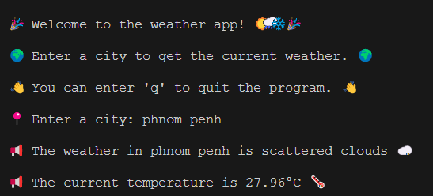
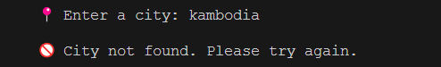

# HW.6 Weather Forecast (API request)

Your task is to build a Weather App ☀️🌧️❄️🌩️.

The app will report the **current weather** of **city** using user input. 

Try your best to **be creative**.

 

## Requirements

1. Develop a `get_weather` function that takes 1 parameter, `city` as a string.

2. This function should make a request to the [OpenWeatherMap API](https://openweathermap.org/api/) to fetch weather data for the given city.

3. The app should have a user-friendly interface. You can look at the class homework showcases for inspiration.

4. The app should handle invalid input gracefully. It should not crash when an invalid city name is provided. Instead, it should inform the user that the input is invalid. __(see Expected Output)__

5. The app should fetch live results from the Internet. It should not use hard-coded or cached data.

 

## Reminders

- Review the requirements and ensure you meet all of them.

- Remember to add sufficient comments to explain your work / any concepts outside of class that you use.

- Run `pytest` to check your work.

 

## Hints:

- [Python Requests Module](https://www.w3schools.com/python/module_requests.asp)

- [Python Dictionary](https://www.w3schools.com/python/python_dictionaries.asp)

 

## Expected Output:

- Your application should ask for a location input from the user.
  
- It should then return the valid weather forecast information.
  > 

- If the location input is incorrect, it should inform the user that the input is invalid.
  > 

  
